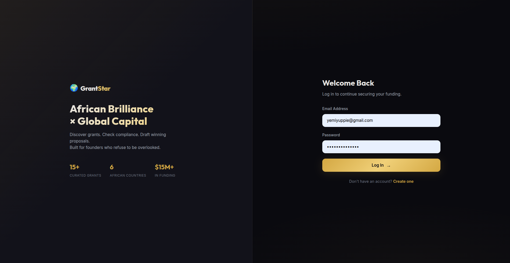
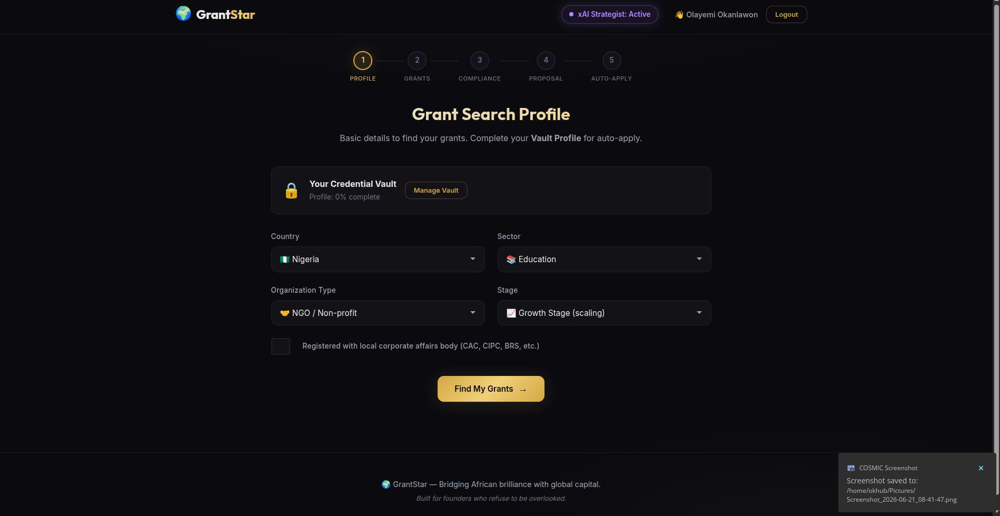
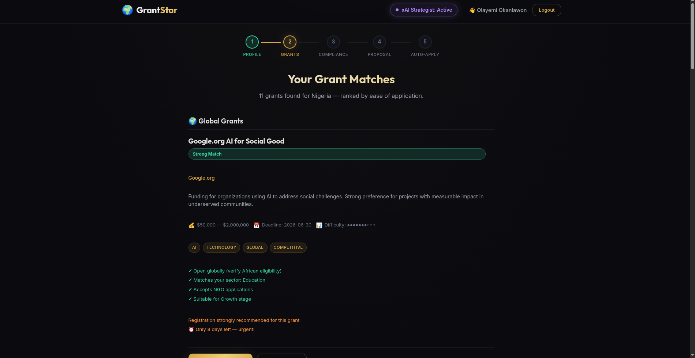
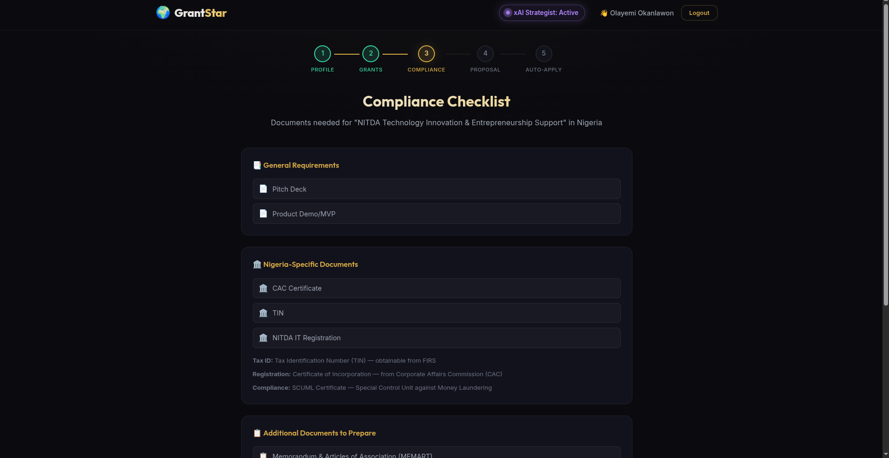
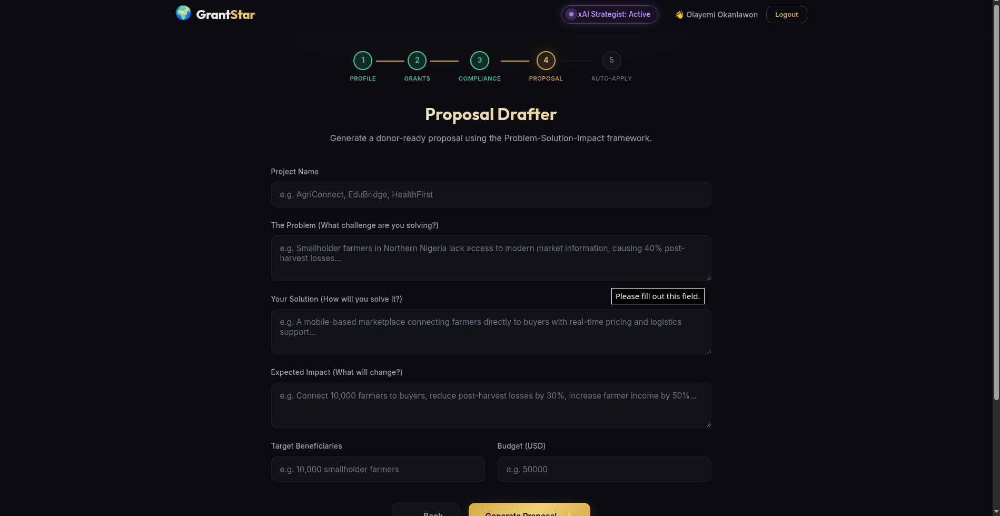

# 🌍 GrantStar — The Premier African-Centric Global Grant Strategist

GrantStar is a specialized AI-powered platform designed to bridge the gap between African brilliance (startups, NGOs, researchers) and global capital. Unlike generalist grant tools, GrantStar understands the specific local contexts of African founders while translating their impact into global languages that donors (USD/EUR/GBP) trust.

## 🚀 Key Features

### 1. Context-Aware Grant Search
- **African Filter:** Filters grants specifically based on eligibility for African countries.
- **Local-to-Global Scoring:** Ranks grants not just by amount, but by "Ease of Application" and "Match Score" based on your local registration status.

### 2. Deep Compliance Intelligence
- **Local Documentation:** Knows exactly what a grant means when it asks for "Tax ID" in different regions (e.g., **TIN** in Nigeria, **KRA Pin** in Kenya, **SARS** in South Africa).
- **Specific Guide:** Provides tips for local certifications like **CAC** (Nigeria), **CR12** (Kenya), **BBBEE** (South Africa), and **SCUML**.

### 3. Proposal Drafter (PSI Framework)
- **Problem-Solution-Impact:** Generates professional drafts tailored for international donors.
- **SDG Alignment:** Automatically aligns your local impact (e.g., "Market Women Empowerment") with UN Sustainable Development Goals (e.g., **SDG 5: Gender Equality**).
- **Global Vocabulary:** Translates local terminology into high-impact global donor language.

### 4. Secure Credential Vault
- **Encrypted Storage:** Uses military-grade encryption to store your organization's sensitive data (Registration numbers, IDs, Bio).
- **Portal Registry:** Save your logins for major grant portals (TEF, Google.org, USAID) in one secure, encrypted vault.

### 5. Auto-Apply Assistant
- **Field Data Mapping:** Intelligent bridging between your vault data and specific grant portal forms.
- **Workflow Automation:** Guided steps for registration and application on complex portals.
- **Character Limit Guard:** Automatically adapts your proposal text to fit strict character limits while maintaining professional quality.

## 🛠️ Technology Stack
- **Backend:** Flask (Python)
- **Database:** SQLite (Encrypted Vault & Auth)
- **Encryption:** Fernet Symmetric Encryption
- **Frontend:** Vanilla JS / CSS3 (Premium Dark Aesthetic)
- **Intelligence:** Proprietary Mapping & Translation Engine

## 🔐 Security First
Your sensitive documentation and portal passwords never leave your control. All vault data is **encrypted at rest**, and access is restricted to your authenticated user session.

---
*GrantStar — Empowing African founders to win on the global stage.*
